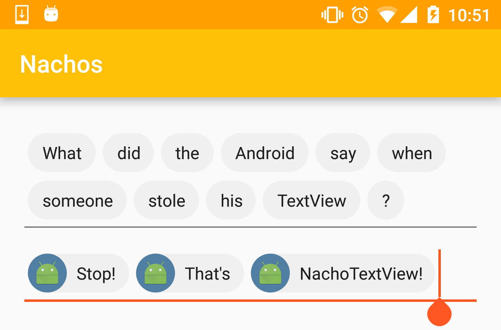
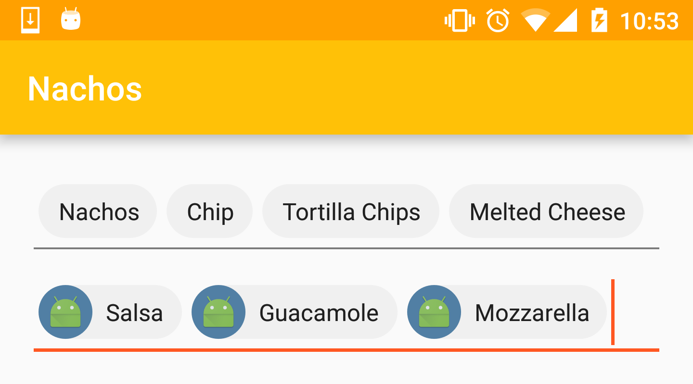
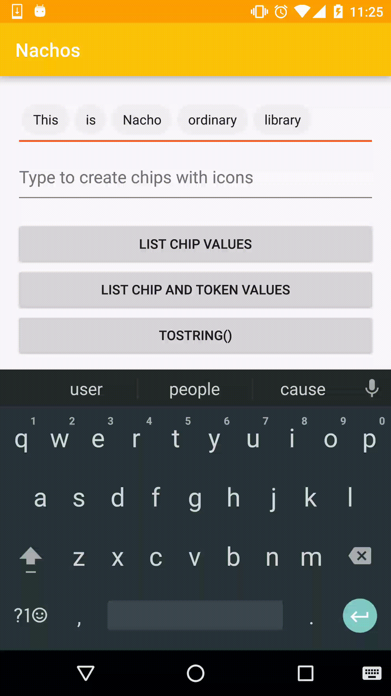
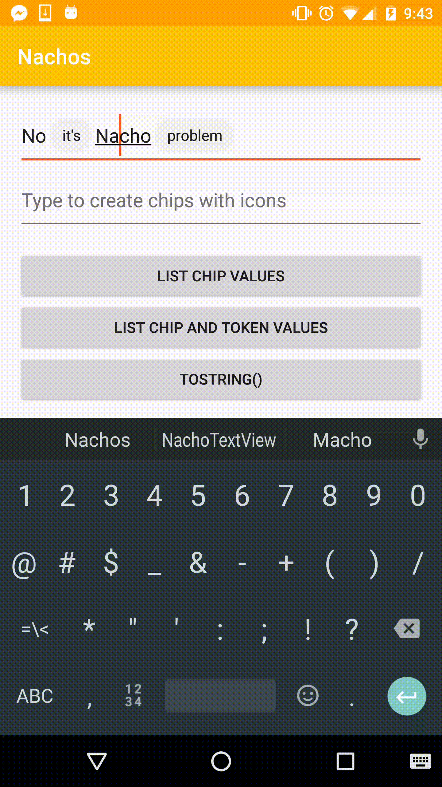
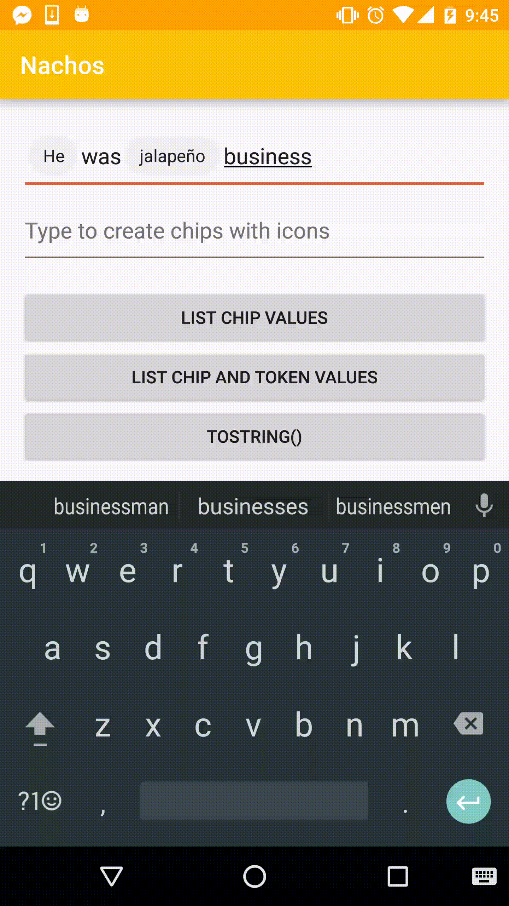
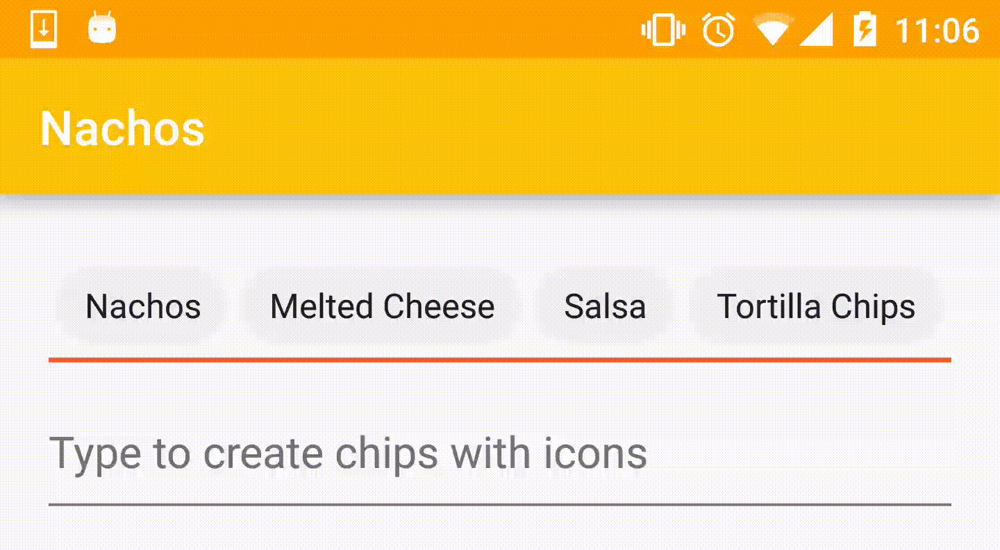
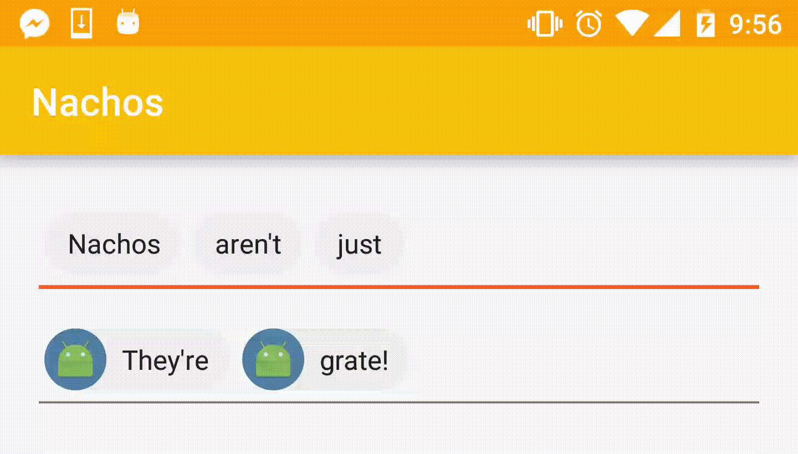

# Nachos for Android #

[](https://jitpack.io/#mgbckr/nachos-v2)

## Table of Contents ##
* [What is Nachos?](#TOC-WhatIsNachos)
* [Key Features](#TOC-KeyFeatures)
* [Installation](#TOC-Installation)
* [Basic Usage](#TOC-BasicUsage)
  * [Customizing the UI](#TOC-BasicUsage-UICustomization)
  * [Showing Suggestions](#TOC-BasicUsage-ChipSuggestions)
  * [Triggering the Creation of Chips when a Character is Typed](#TOC-BasicUsage-ChipTerminators)
  * [Editing Chips](#TOC-BasicUsage-Editing)
  * [Listening for when a Chip is Touched](#TOC-BasicUsage-OnChipClickListener)
  * [Preventing the User from Typing Characters](#TOC-BasicUsage-IllegalCharacters)
  * [Reading the Values of the Chips](#TOC-BasicUsage-ReadingValues)
* [Advanced Usage](#TOC-AdvancedUsage)
  * [Validating the Contents of the TextView](#TOC-AdvancedUsage-Validator)
  * [Customizing the Creation/Identification of Chips/Tokens](#TOC-AdvancedUsage-ChipTokenizer)
  * [Using a Custom UI Element for the Chips](#TOC-AdvancedUsage-ChipCreator)
* [License](#TOC-License)
* [Acknowledgements](#TOC-Acknowledgements)

## <a name="TOC-WhatIsNachos"></a>What is Nachos? ##
Nachos is a library for Android that provides a custom TextView allowing users to enter text and create material chips in the text field.



Nachos is not directly coupled to any data source so it allows for much more extensive customization.

## <a name="TOC-KeyFeatures"></a>Key Features ##

* Uses an EditText in combination with spans to avoid any overhead associated with inflating layouts for views
* Full control over when chips are created
  * Create chips when certain characters are typed
  * Create chips when suggestions are selected
  * Manually (programmatically) create chips
* Matches the [material specification](https://material.google.com/components/chips.html) created by Google
  * You can also fully customize the appearance of the chips
* Show a dropdown of suggestions that will create chips when they are selected
* Offers the ability to edit chips on touch (in place or by moving them to the end of the text field)
* Chips are ellipsized when they are longer than the width of the TextView
* Optionally display an icon within the chips
* Handles copying and pasting


## <a name="TOC-Installation"></a>Installation ##

Add this line to your project level build.gradle:

```groovy
buildscript {
  repositories {
    jcenter()
  }
```

Add this line to your module level build.gradle:

```groovy
dependencies {
    implementation "com.hootsuite.android:nachos:1.1.1"
}
```

## <a name="TOC-BasicUsage"></a>Basic Usage ##

Include a `NachoTextView` in your xml layout as follows:
```xml
<com.hootsuite.nachos.NachoTextView
    android:id="@+id/nacho_text_view"
    android:layout_width="match_parent"
    android:layout_height="wrap_content"/>
```

#### <a name="TOC-BasicUsage-UICustomization"></a>Customizing the UI ####
NachoTextView offers several custom attributes that allow you to control the appearance of the chips it creates:
* `chipHorizontalSpacing` - The horizontal space between chips
* `chipBackground` - The background color of the chip, can be a ColorStateList to change color when the chip is clicked
* `chipCornerRadius` - The corner radius of the chip background
* `chipTextColor` - The color of the chip text
* `chipTextSize` - The font size of the chip text
* `chipHeight` - The height of a single chip
* `chipVerticalSpacing` - The vertical space between chips on consecutive lines.

Note: `chipVerticalSpacing` can only be used if `chipHeight` is also set

Use these attributes as follows:
```xml
<com.hootsuite.nachos.NachoTextView
    android:id="@+id/nacho_text_view"
    android:layout_width="match_parent"
    android:layout_height="wrap_content"
    app:chipHorizontalSpacing="2dp"
    app:chipBackground="@color/chip_background"
    app:chipTextColor="@color/cheddar"
    app:chipTextSize="16dp"
    app:chipHeight="30dp"
    app:chipVerticalSpacing="3dp"/>
```

Don't forget to declare the app namespace on your root layout element:
```xml
<LinearLayout
    xmlns:android="http://schemas.android.com/apk/res/android"
    xmlns:tools="http://schemas.android.com/tools"
    xmlns:app="http://schemas.android.com/apk/res-auto"
    .../>
```

If you don't include any of these attributes, they will be set to default values that match the material spec.



#### <a name="TOC-BasicUsage-ChipSuggestions"></a>Showing Suggestions ####

NachoTextView extends MultiAutoCompleteTextView which allows you to provide suggestions to the user as they are typing. The suggestions are generated based on only the text of the current token (not the contents of the entire text field).



Providing suggestions for the NachoTextView works the same way as it would for a MultiAutoCompleteTextView:

Create an adapter:
```java
String[] suggestions = new String[]{"Tortilla Chips", "Melted Cheese", "Salsa", "Guacamole", "Mexico", "Jalapeno"};
ArrayAdapter<String> adapter = new ArrayAdapter<>(this, android.R.layout.simple_dropdown_item_1line, suggestions);
```

And call `setAdapter(Adapter)` on the NachoTextView:
```java
nachoTextView.setAdapter(adapter);
```

When a suggestion is tapped, the object from the adapter that represented that suggestion is associated with the chip that gets created. It can later be accessed through `Chip.getData()`. See [Reading the Values of the Chips](#TOC-BasicUsage-ReadingValues) for details.

#### <a name="TOC-BasicUsage-ChipTerminators"></a>Triggering the Creation of Chips when a Character is Typed ####

The characters that should cause the creation of a chip when typed are referred to as chip terminators. Each chip terminator can be associated with one of three behaviors which control what will happen when that character is encountered in the text field:

`BEHAVIOR_CHIPIFY_ALL`:
* When a chip terminator character is encountered in newly inserted text, all tokens in the whole text view will be chipified


In the example above, `'\n'` (the enter key) is a chip terminator associated with `BEHAVIOR_CHIPIFY_ALL`

`BEHAVIOR_CHIPIFY_CURRENT_TOKEN`:
* When a chip terminator character is encountered in newly inserted text, only the current token (that in which the chip terminator character was found) will be chipified. This token may extend beyond where the chip terminator character was located.



In the example above, `';'` (semicolon) is a chip terminator associated with `BEHAVIOR_CHIPIFY_CURRENT_TOKEN`

`BEHAVIOR_CHIPIFY_TO_TERMINATOR`:
* When a chip terminator character is encountered in newly inserted text, only the range of text from the previous chip to the chip terminator character will be chipified. This may not be an entire token.



In the example above, `' '` (space) is a chip terminator associated with `BEHAVIOR_CHIPIFY_TO_TERMINATOR`

---

To associate a behavior with a particular terminator, call:
```java
nachoTextView.addChipTerminator(character, behavior);
```

For example, if you want all the plain text in the text field to be chipified when the user presses enter, call:
```java
nachoTextView.addChipTerminator('\n', ChipTerminatorHandler.BEHAVIOR_CHIPIFY_ALL);
```
And, if you want just the text from the previous chip (or beginning) up to the cursor to be chipified when the user presses space, call:
```java
nachoTextView.addChipTerminator(' ', ChipTerminatorHandler.BEHAVIOR_CHIPIFY_TO_TERMINATOR);
```

#### <a name="TOC-BasicUsage-Editing"></a>Editing Chips ####
NachoTextView supports editing chips on touch. To enable this behavior call:
```java
nachoTextView.enableEditChipOnTouch(moveChipToEnd, chipifyUnterminatedTokens);
```

If `moveChipToEnd` is true, the chip will be moved to the end of the text field when it is tapped. It will then be unchipified and the user will be able to edit it.



If `moveChipToEnd` is false, the chip will be unchipified in place allowing the user to edit it right where it is.


If `chipifyUnterminatedTokens` is true, all plain text (tokens) in the text field will be chipified before the chip to be edited is unchipified. Otherwise the chip to be edited will simply be unchipified without affecting the other text.

#### <a name="TOC-BasicUsage-OnChipClickListener"></a>Listening for when a Chip is Touched ####
If you want to perform any custom actions when a chip is clicked you can attach an `OnChipClickListener` to the NachoTextView:
```java
nachoTextView.setOnChipClickListener(new NachoTextView.OnChipClickListener() {
    @Override
    public void onChipClick(Chip chip, MotionEvent motionEvent) {
        // Do something
    }
});
```

In addition to any action you perform in an `OnChipClickListener` the following will happen when a chip is touched:
* The chip's state will be set to `pressed` and `selected`
  * (`chip.setState(View.PRESSED_SELECTED_STATE_SET)`)
* The chip will be put in edit mode if `enableEditChipOnTouch(...)` was called and `disableEditChipOnTouch()` hasn't been called since

#### <a name="TOC-BasicUsage-IllegalCharacters"></a>Preventing the User from Typing Characters ####

If you want to prevent the user from typing certain characters, you can call:
```java
nachoTextView.setIllegalCharacters(illegalCharacter1, illegalCharacter2, ...);
```

`setIllegalCharacters(...)` accepts a varargs list of characters so you can make as many characters as you want illegal. These characters, when typed, will be immediately deleted from the text. If the user pastes text into the NachoTextView, any illegal characters will be removed from the text before it is entered.

#### <a name="TOC-BasicUsage-ReadingValues"></a>Reading the Values of the Chips ####

NachoTextView exposes several methods to read the contents of the text view:
* `getAllChips()`
  * Returns the actual `Chip` objects contained in the text view
  * `Chip` is an interface that represents a chip and declares methods to access the text (`getText()`), data (`getData()`), and ui attributes of the chip
* `getChipValues()`
  * Returns a List of the string values of all the chips in the text
* `getTokenValues()`
  * Returns a List of the string values of all the tokens (unchipped text) in the text 
* `getChipAndTokenValues()`
  * Returns a combination of the chip values and token values in the text.
  * Effectively a concatenation of the previous two methods (`getChipValues()` and `getTokenValues()`)

Example:
```java
// Iterate over all of the chips in the NachoTextView
for (Chip chip : nachoTextView.getAllChips()) {
    // Do something with the text of each chip
    CharSequence text = chip.getText();
    // Do something with the data of each chip (this data will be set if the chip was created by tapping a suggestion)
    Object data = chip.getData();
}
```

## <a name="TOC-AdvancedUsage"></a>Advanced Usage ##

This section will often refer to the terms "token" and "chip".
* Token means plain, unchipped text
* Chip means chipped text

#### <a name="TOC-AdvancedUsage-Validator"></a>Validating the Contents of the TextView ####

NachoTextView supports the use of a `NachoValidator`. When validation occurs is controlled by `AutoCompleteTextView`; however, it usually occurs in scenarios such as losing focus. Nachos includes an implementation of `NachoValidator`: `ChipifyingNachoValidator`. This implementation considers text to be invalid if it contains tokens and validates the text by chipifying all tokens.




To attach a `NachoValidator`, call `setNachoValidator(...)`:
```java
// Example
nachoTextView.setNachoValidator(new ChipifyingNachoValidator());
```

To disable validation, call:
```java
nachoTextView.setNachoValidator(null);
```

#### <a name="TOC-AdvancedUsage-ChipTokenizer"></a>Customizing the Creation/Identification of Chips/Tokens ####

The creation and identification of chips in a NachoTextView is centered around the `ChipTokenizer` interface. This interface defines methods to:
* Identify tokens
* Identify chips
* Convert between chips and tokens
* Remove chips

The default implementation of `ChipTokenizer` used by NachoTextView is `SpanChipTokenizer`. This implementation attaches spans to the text in order to display a chip. It also surrounds the text in marker characters to allow easy identification of chips and tokens (unchipped text).

If you would like to customize the way the NachoTextView creates and identifies its chips you can write your own implementation of `ChipTokenizer` and tell the NachoTextView to use it by calling:
```java
nachoTextView.setChipTokenizer(new MyChipTokenizer());
```

Note: Do NOT call `setTokenizer(...)` on NachoTextView unless you absolutely know what you are doing. `setTokenizer(...)` is a method defined in `MultiAutoCompleteTextView` that sets the `Tokenizer` to be used to provide suggestions for the current token. This method gets called automatically by `setChipTokenizer(...)` so calling `setChipTokenizer(...)` alone should be enough.

Note #2: If you want to disable all chipping behavior in the NachoTextView, you can call:
```java
nachoTextView.setChipTokenizer(null);
```

#### <a name="TOC-AdvancedUsage-ChipCreator"></a>Using a Custom UI Element for the Chips ####

The `SpanChipTokenizer` implementation of `ChipTokenizer` provides some built-in customization support through the `ChipCreator` interface.

`ChipCreator` defines 3 methods that handle the creation and customization of the chip that gets displayed as a span by `SpanChipTokenizer`.

By default, NachoTextView uses a `ChipSpanChipCreator` which produces chips that are instances of the `ChipSpan` class. If you want to customize the ChipSpans that get created, you can use a custom subclass of `ChipSpanChipCreator`:
```java
// Example: we want to show the launcher icon in all of our ChipSpans:
nachoTextView.setChipTokenizer(new SpanChipTokenizer<>(this, new ChipSpanChipCreator() {
    @Override
    public ChipSpan createChip(@NonNull Context context, @NonNull CharSequence text, Object data) {
        return new ChipSpan(context, text, ContextCompat.getDrawable(MainActivity.this, R.mipmap.ic_launcher), data);
    }

    @Override
    public void configureChip(@NonNull ChipSpan chip, @NonNull ChipConfiguration chipConfiguration) {
        super.configureChip(chip, chipConfiguration);
        chip.setShowIconOnLeft(true);
    }
}, ChipSpan.class));
```

If you want even more customization (for example if you wanted to use a span other than a `ChipSpan`), you can use a custom `ChipCreator`:
```java
nachoTextView.setChipTokenizer(new SpanChipTokenizer<>(this, new ChipCreator<MySpan>() {
    @Override
    public MySpan createChip(@NonNull Context context, @NonNull CharSequence text, Object data) {
        return new MySpan(context, text, data);
    }
    
    @Override
    public MySpan createChip(@NonNull Context context, @NonNull MySpan existingSpan) {
        return new MySpan(context, existingSpan);
    }

    @Override
    public void configureChip(@NonNull MySpan chip, @NonNull ChipConfiguration chipConfiguration) {
        // Configure the span
    }
}, MySpan.class));
```


## <a name="TOC-License"></a>License ##

Nachos is released under the Apache License, Version 2.0. See [LICENSE](LICENSE) for details.

## <a name="TOC-Acknowledgements"></a>Acknowledgements ##

Special thanks to the author of nachos, [Noah Tajwar](https://github.com/noaht11) and to the original author of our internal library, [Dave Russell](https://github.com/hootsuitedave)!
